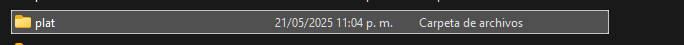

# PLANTATECH DASHBOARD

## Descripcion
Hemos desarrollado un prototipo de dashboard para la gestion de nuestra maceta inteligente que se encuentra en fase de desarrollo.

## Requisitos necesarios para ejecutar el proyecto:
1. Clonar el repositorio.
2. Servidor web local o hosting 
3. Base de datos MySQL
4. PHP 5.6 o superior
5. Navegador web

## Notas
Solo se ha probado con Chrome 
Solo se ha probado con Laragon 
Se debe usar la simulacion de dominio en laragon para poder hacer pruebas locales, ya que el dominio es necesario para realizar las peticiones ajax correctamente

## Pasos de instalacion local

1. Crear un nuevo proyecto en laragon y agregarle el nombre "plat"


Este proceso nos creara una carpeta en la ruta C:\laragon\www\plat

2. Clonar el repositorio en la carpeta plat que se creo anteriormente


Debemos tener encuenta que al clonar se crea una subcarpeta llamada plat debemos pasar todo el contenido a la carpeta principal

3. Importar la base de datos desde el archivo sql/plat.sql


4. Editar los archivos de configuracion para el correcto funcionamiento de la aplicacion


Remplazar la ruda de la api por la ruta real donde esta alojada la API, si se esta trabajando localmente debe ser http://plat.test/api/, eso en caso no haber cambiado la estructura de carpetas y nombre de la carpeta principal y el dominio de pruebas de laragon

Los archivos se encuentran en todas las carpetas hooks/peticiones.js

Remplazar los datos de la conexion a la base de datos por los valores reales de su base de datos


En la ruta api/library/conexion.php

5. Ingresar al navegador y acceder a la pagina index.php


6. Debemos iniciar sesion con las credenciales de administrador:
Usuario: gilurbina09@gmail.com
Contraseña: Zeldris@22

7. Una vez iniciada la sesion nos aparecera la pantalla principal


8. Para probar la funcionalidad del sistema debe enviar datos atraves de postman o directo desde su maceta inteligente si ya la tiene armada

9. Para probar en postman debe utilizar los siguientes endpoints:
http://plat.test/api/registrar_lecturas


## Ejemplo de Datos de Sensores (JSON)

Este es un ejemplo del formato que usa el sistema para recibir o almacenar datos de los sensores conectados (como luz, temperatura, humedad del aire y del suelo):

```json
{
    "correo": "gilurbina09@gmail.com",
    "nivel_luz": "20",
    "humedad_aire": "200",
    "temperatura": "499",
    "humedad_suelo": "200"
}

